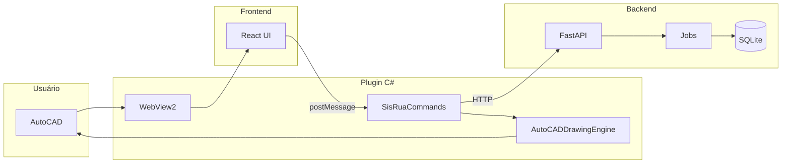

# Como cada perfil profissional acompanha o projeto sisRUA

O sisRUA é um plugin AutoCAD (C#) com UI React em WebView2 e backend FastAPI (Python): GIS → CAD (OSM/GeoJSON → polylines e blocos no Model Space). A análise abaixo indica **por onde cada perfil entra**, **o que revisa** e **como segue** o projeto de forma profissional.

---

## 1. Dev Sênior (backend + plugin + decisões técnicas)

**Objetivo:** Garantir coerência técnica, APIs estáveis, integração C# ↔ Python ↔ React e qualidade de código.

**Pontos de entrada e ordem sugerida:**

- [docs/ARQUITETURA.md](ARQUITETURA.md) — Visão geral: plugin C# orquestra; React envia ações; FastAPI expõe `/api/v1/*` e serve o frontend; fluxos OSM e GeoJSON.
- [README.md](../README.md) — Estrutura de pastas (`src/backend`, `src/frontend`, `src/plugin`), pré-requisitos (Python, Node, .NET), Docker e build manual.
- [docs/API_STABILITY_POLICY.md](API_STABILITY_POLICY.md) — Versionamento `/api/v1/*`, garantias de estabilidade e política de breaking changes.
- [docs/adr/](adr/) — Decisões arquiteturais (ADRs) para contexto de por que as coisas estão como estão.

**Artefatos que acompanha:**

| Área      | Onde                                                                 | Foco                                                   |
| --------- | -------------------------------------------------------------------- | ------------------------------------------------------ |
| Backend   | `src/backend/backend/` — `api.py`, `core/`, `services/`              | Contratos de API, jobs, CRS, migrações                 |
| Plugin    | `src/plugin/` — `SisRuaPlugin.cs`, `SisRuaCommands.cs`, `Engine/`   | WebView2, mensagens UI, desenho CAD, Engine            |
| Contratos | `schema/v1/` — JSON Schemas (PrepareResponse, JobStatus, etc.)       | Consistência request/response entre backend e clientes |

**Fluxo de trabalho típico:**

1. Antes de mudar API: checar [API_STABILITY_POLICY.md](API_STABILITY_POLICY.md) e `schema/`; atualizar schema se necessário.
2. Backend: rodar `pytest` em `src/backend/`; revisar `src/backend/backend/core/` (DB, migrations, circuit breaker, rate limit).
3. Plugin: build `src/plugin/sisRUA.csproj` (net48 + net8.0-windows); garantir que chamadas à API e desenho (polylines/blocos) sigam os contratos.
4. Integração: seguir fluxos em [ARQUITETURA.md](ARQUITETURA.md) (OSM e GeoJSON) e validar com testes em `tests/` e `src/backend/tests/`.

---

## 2. Fullstack Sênior (backend + frontend + integração ponta a ponta)

**Objetivo:** Garantir que a cadeia UI → API → processamento → desenho CAD funcione de ponta a ponta e que backend e frontend evoluam alinhados.

**Pontos de entrada:**

- [docs/ARQUITETURA.md](ARQUITETURA.md) — Fluxos OSM e GeoJSON (passos 1–5) e papel de cada camada.
- `src/frontend/src/api.js` e `src/frontend/src/sdk/` — Como o frontend chama o backend (e como o C# chama os mesmos endpoints).
- `src/backend/backend/api.py` — Rotas e entrada de dados; `services/jobs.py`, `geojson.py`, `gis_core/` para lógica de negócio.
- `schema/v1/` — Contratos compartilhados (PrepareRequest/Response, JobStatus, etc.).

**Artefatos que acompanha:**

- **Backend:** `src/backend/` — API, serviços, GIS (CRS, OSM, geometria), jobs assíncronos.
- **Frontend:** `src/frontend/src/` — `App.jsx`, componentes em `components/`, hooks em `hooks/`, serviços em `services/`.
- **Plugin (consumidor):** `src/plugin/SisRuaCommands.cs` e `SisRuaPalette.cs` — como C# recebe mensagens da UI e chama backend; `Engine/` para desenho.

**Fluxo de trabalho típico:**

1. Nova ação na UI (ex.: novo tipo de import): definir contrato em `schema/`; implementar endpoint em backend; expor no `api.js` ou SDK; tratar mensagem no C# e desenho no Engine.
2. Garantir que jobs (prepare OSM/GeoJSON) tenham polling e feedback na UI (`JobOverlay.jsx`, progresso no backend).
3. Rodar stack local: `docker-compose up` ou backend (standalone) + frontend (Vite) + NETLOAD do plugin; validar fluxo completo.

---

## 3. Frontend Sênior / Especialista em UI-UX

**Objetivo:** Experiência de uso na paleta (WebView2), consistência visual, acessibilidade e alinhamento com requisitos de usuário (docs de UAT e requisitos).

**Pontos de entrada:**

- [qa/requirements.md](../qa/requirements.md) — FR e NFR (ex.: FR-002 abrir UI, FR-003/004 OSM/GeoJSON, FR-007 feedback de jobs, NFR-005 Trusted Locations).
- [docs/USO.md](USO.md) e [docs/INSTALACAO.md](INSTALACAO.md) — Como o usuário usa e instala; pontos de fricção na UX.
- `src/frontend/src/` — Estrutura da UI: `App.jsx`, `components/` (MapView, Sidebar, JobOverlay, SettingsPanel, Toast, ErrorBoundary), `hooks/` (mapa, arquivo, lógica).

**Artefatos que acompanha:**

| Tipo           | Onde                                      | Foco                                                                   |
| -------------- | ----------------------------------------- | ---------------------------------------------------------------------- |
| Componentes    | `src/frontend/src/components/`            | Fluxos principais: mapa, import (OSM/GeoJSON/KMZ), jobs, configurações |
| Estilos e tema | `src/frontend/src/index.css`, Tailwind     | Design system, responsividade na paleta                                |
| Estado e API   | `src/frontend/src/hooks/`, `api.js`, `services/` | Feedback de loading, erro e progresso (FR-007)                         |
| Testes UI      | `src/frontend/src/` — `*.test.jsx`, vitest | Regressão de componentes e fluxos                                      |

**Fluxo de trabalho típico:**

1. Mapear jornadas em [qa/requirements.md](../qa/requirements.md) (FR-002 a FR-007, etc.) para componentes e telas.
2. Revisar acessibilidade, mensagens de erro e estados vazios/loading em `components/` e `hooks/`.
3. Alinhar com [UAT_CERTIFICATION_v0.9.0.md](UAT_CERTIFICATION_v0.9.0.md) e [qa/manual/](../qa/manual/) (execução manual e evidências).
4. Rodar `npm run dev` e testar dentro do AutoCAD (WebView2) para validar tamanho da paleta e interação com o mapa.

---

## 4. DevOps / QA

**Objetivo:** Pipeline estável, testes automatizados, segurança (SAST/SCA), evidências de QA e critérios de release.

**Pontos de entrada:**

- `.github/workflows/` — [ci.yml](../.github/workflows/ci.yml) (backend + frontend CI), [ci_qa.yml](../.github/workflows/ci_qa.yml) (pytest, vitest, Bandit, pip-audit, SonarCloud), build_backend_exe, deploy_landing_pages.
- [qa/test-plan.md](../qa/test-plan.md) — Objetivo, escopo (backend, frontend, plugin), estratégia (automatizado vs manual), ambientes e critérios de entrada/saída.
- [qa/requirements.md](../qa/requirements.md) — FR/NFR com IDs para rastreabilidade (traceability).

**Artefatos que acompanha:**

| Área                 | Onde                                                    | Foco                                                                          |
| -------------------- | ------------------------------------------------------- | ----------------------------------------------------------------------------- |
| CI                   | `.github/workflows/ci.yml`                              | Python 3.10, Node 20, pytest, lint, vitest, build frontend                    |
| QA pipeline          | `.github/workflows/ci_qa.yml`                            | pytest (JUnit + coverage), vitest + Playwright, Bandit, pip-audit, SonarCloud |
| Plano de testes      | [qa/test-plan.md](../qa/test-plan.md), [qa/README.md](../qa/README.md) | Escopo, evidências, `traceability.csv`                                        |
| Manual / evidência   | `qa/manual/`                                            | Roteiros e template de registro de execução                                   |
| Instalador / release | `installer/` — build_installer.cmd, sisRUA.iss          | Critério de entrada: build Release e bundle com backend EXE                   |

**Fluxo de trabalho típico:**

1. Garantir que push/PR em main/develop disparem `ci.yml`; em main (e QA) rodar `ci_qa.yml` com artefatos em `qa/out/`.
2. Manter [qa/requirements.md](../qa/requirements.md) e [qa/test-plan.md](../qa/test-plan.md) alinhados; preencher rastreabilidade (requisito → TC → evidência).
3. Executar testes manuais críticos com [qa/manual/execution-record-template.md](../qa/manual/execution-record-template.md); anexar screenshots/logs conforme test-plan.
4. Validar critérios de release: build do plugin (Release), `sisrua_backend.exe` no bundle, landing/docs quando aplicável.

---

## 5. Especialista em Database e SQL

**Objetivo:** Modelo de dados consistente, migrações seguras, índices e uso de SQLite/GeoPackage no backend e no plugin (persistência de projetos).

**Pontos de entrada:**

- `src/backend/backend/core/database.py` — Caminho do DB (`%LOCALAPPDATA%/sisRUA/projects.db`), conexão SQLite, WAL, inicialização de tabelas GeoPackage (`gpkg_*`).
- `src/backend/backend/core/migrations.py` — Versão atual (CURRENT_VERSION), definição de migrações (índices, novas colunas, versioning para optimistic locking).
- `src/backend/seed.py` — Script de seed (se existir) e criação inicial de tabelas.
- **Plugin (C#):** `src/plugin/ProjectRepository.cs` — Persistência de projetos e features no SQLite (FR-014, FR-015); `src/sisRUA.Core/` para DTOs compartilhados.

**Artefatos que acompanha:**

| Área                 | Onde                                                                 | Foco                                                                              |
| -------------------- | -------------------------------------------------------------------- | --------------------------------------------------------------------------------- |
| Backend DB           | `database.py`, `migrations.py`                                       | Esquema, GeoPackage, migrações incrementais                                       |
| Serviços que usam DB | `src/backend/backend/services/projects.py` (se existir), jobs e cache | Queries, transações, integridade                                                  |
| Plugin SQLite        | `src/plugin/ProjectRepository.cs`                                    | Tabelas Projects/CadFeatures, INSERT/UPDATE/SELECT, compatibilidade com migrações |
| Ferramentas          | `src/backend/tools/` — analyze_queries, migrate_indexes, verify_indexes | Análise de queries, índices e migrações                                           |
| Testes de DB         | `tools/test_database_concurrency.py`, `test_migrations.py`, `test_optimistic_locking.py` | Concorrência, migrações e locking                                                 |

**Fluxo de trabalho típico:**

1. Antes de alterar esquema: criar migração em `migrations.py` (só ADD/CREATE não-destrutivos); incrementar CURRENT_VERSION; garantir rollback seguro se necessário.
2. Revisar índices (ex.: `idx_cadfeatures_project_id`, `idx_cadfeatures_project_type`) e uso em queries em ProjectRepository e serviços backend.
3. Garantir que backend (Python) e plugin (C#) usem o mesmo arquivo DB (ou política clara de separação) e o mesmo contrato de tabelas (Projects, CadFeatures, colunas de versioning).
4. Rodar testes de migração, concorrência e optimistic locking em `tools/`; usar `verify_indexes.py` e similares após mudanças.

---

## Visão geral dos fluxos (referência)

---

## Resumo por perfil

| Perfil           | Primeiro documento     | Principais pastas                                      | Foco                                               |
| ---------------- | ---------------------- | ------------------------------------------------------ | -------------------------------------------------- |
| Dev Sênior       | [ARQUITETURA.md](ARQUITETURA.md) | `src/backend/`, `src/plugin/`, `schema/`               | APIs, contratos, integração C#/Python/React        |
| Fullstack Sênior | [ARQUITETURA.md](ARQUITETURA.md) | `src/backend/`, `src/frontend/src/`, `src/plugin/`     | Fluxo ponta a ponta e alinhamento backend–frontend |
| Frontend UI/UX   | [qa/requirements.md](../qa/requirements.md) | `src/frontend/src/components/`, `hooks/`               | Jornadas, acessibilidade, feedback e UAT           |
| DevOps/QA        | ci_qa.yml, [qa/test-plan.md](../qa/test-plan.md) | `.github/workflows/`, `qa/`, `installer/`              | Pipeline, testes, evidências e release             |
| DB/SQL           | database.py, migrations.py | `backend/core/`, `ProjectRepository.cs`, `tools/`     | Esquema, migrações, índices e consistência         |

Cada perfil deve usar este guia como roteiro de entrada e, a partir daí, aprofundar nos artefatos e fluxos listados para acompanhar o projeto de forma consistente e profissional.

Para uma visão de **como cada perfil analisa** o projeto (critérios, pontos fortes/fracos e conclusões por perfil), veja [ANALISE_POR_PERFIL.md](ANALISE_POR_PERFIL.md).
